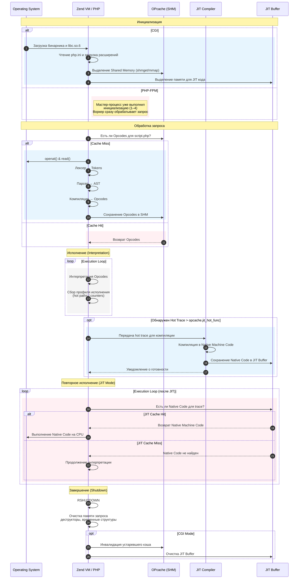

## [На главную](README.md)
## 1. Lifecycle PHP, CGI,

В этом документе описывается жизненный цикл выполнения PHP-кода с использованием OPcache и JIT, от запуска PHP-FPM до завершения запроса.

- Жизненный цикл PHP начинается  с загрузки бинарника /usr/local/bin/php, загружаются системные библиотеки, читается конфигурация php.ini, подключаются расширения.
- Затем происходит инициализация памяти для опкэша и буфера JIT. Подготовка инфраструктуры в общем.
- Затем Zend VM проверяет есть ли опкод для скрипта, валиден ли кэш и тд. 
- If: кэш хит, то возвращает готовый байт код и этапы чтения и компиляции пропускаются. 
- Else: При кэш мисе делает openat() открытие файла, чтение и начинается генерация байткода - сперва лексический и синтаксический анализ. Если включен OpCache, байт-код кешируется в shared memory.
- Затем Zend VM интерпретирует байт-код. Во время выполнения, если включен JIT, система следит за hot counters, hot traces и копит данные для JIT. 
- If: обнаружен hot trace, то передает этот трейс в JIT compiler, компилятор его в native machine code и результат сохрится в JIT буфер.
- Loop: и при следующих выполнениях Zend VM проверяет наличие native machine code, 
- If: найден, то выполняет напрямую CPU без интерпретации Opcodes, что работает намного быстрее.
- Else: JIT cache miss, то продолжается интерпретация
- После выполнения в простом CGI все ресурсы освобождаются. В режиме FPM процесс переиспользуется для следующих запросов, что уменьшает накладные расходы на инициализацию.

## 2. Разница PHP-CGI и PHP-FPM
- **В традиционном CGI** веб-сервер при каждом запросе создаёт новый процесс приложения, передавая данные через переменные окружения и стандартные потоки ввода-вывода. PHP-CGI следует этой модели, выполняя все этапы инициализации (загрузку бинарника, парсинг конфигов, инициализацию расширений и shared memory для Opcache) для каждого отдельного запроса, что создаёт значительные накладные расходы.

- **PHP-FPM** это демон-менеджер PHP-процессов, который по FastCGI принимает запросы от Nginx и отдаёт ему ответ, управляет пулом воркеров, обеспечивает высокую производительность. Вместо создания процесса на каждый запрос, master-процесс PHP-FPM выполняет всю подготовительную работу один раз при старте для воркеров. Рабочие процессы (workers) уже содержат всё необходимое в оперативной памяти (сохраняют OpCache между запросами) и сразу переходят к выполнению скрипта, что ускоряет обработку запросов в разы за счёт исключения повторяющейся инициализации.

## 3. Interpreter vs Compiler vs PHP JIT

### 📝 Базовые понятия

**Compiler** и **Interpreter** — это переводчики, которые преобразуют исходный код в машинный (0 и 1), понятный компьютеру.

### 🖥 Interpreter (Интерпретатор)

Интерпретатор читает код **строка за строкой** и сразу выполняет.

#### ➖ Минусы:
- Медленнее, потому что код выполняется построчно  
  *(и каждый раз заново переводится во время выполнения)*

### ⚙ Compiler (Компилятор)

Компилятор переводит **весь исходный код целиком** в машинный код *до запуска программы*.

#### ➖ Минусы:
- Если есть ошибка — компилятор всё равно создаст программу,  
  а ошибка проявится только **во время выполнения**, что усложняет отладку.

#### ➕ Плюсы:
- Гораздо быстрее: код компилируется **один раз**, а запускается уже машинный.

## 3.1 Как работает JIT

### Что делает PHP JIT (Just-In-Time Compiler)

### 1️⃣ На старте — обычная интерпретация  
PHP сперва работает медленно:  
- читает код,  
- анализирует,  
- выполняет каждую строку вручную.

Ничего волшебного.

### 2️⃣ Во время работы JIT собирает статистику  
Он смотрит:

- Какие функции вызываются **тысячи раз** — «горячий код»
- Какие типы туда реально приходят (int? string?)
- Какие ветки `if` почти всегда выполняются
- Какие циклы выполняются чаще других

### 3️⃣ Когда код становится «hot», JIT компилирует его 💥  
Прямо **во время выполнения**, JIT говорит:

> «О, этот цикл выполнялся 20 000 раз — ясно, что он делает!  
>  Я скомпилирую его в настоящий машинный код.»

И превращает горячие участки в быстрый машинный код.

### 🚀 Результат
- Часто используемые функции начинают работать **в разы быстрее**
- Циклы, рекурсия, математика, обработка строк — ускоряются

### ✔ Итог

- PHP в начале работает как интерпретатор  
- JIT наблюдает  
- Часто используемый код **автоматически превращается в машинный**  
- Скрипт ускоряется без изменения исходного кода

## 3.2 Разница между OPCode и JIT-кодом

### 🟦 1. Что такое OPCode

OPCode — это **байткод PHP**, промежуточный формат между исходным кодом и реальным машинным кодом.

PHP берёт твой код →  
парсит →  
компилирует в опкоды →  
интерпретатор **Zend VM** выполняет каждый опкод по одному.

- ✅ OPCode = «байткод PHP»  
- ❌ OPCode ≠ машинный код  
- Это инструкции **для виртуальной машины PHP** — Zend VM.

### 🟥 2. Что такое JIT-код

JIT-код — это **настоящий машинный код**, который процессор может выполнять напрямую.

Когда JIT видит, что кусок кода используется много раз (**«горячий» код**):  
→ берёт OPCode,  
→ анализирует типы и логику,  
→ переоптимизирует,  
→ компилирует в реальные инструкции CPU.

- ✅ JIT-код = машинный код  
- ❌ JIT-код **не выполняется Zend VM** — работает напрямую на CPU.

### 🧨 Коротко и жёстко:

> **OPCode** — это инструкции *для PHP*.  
> **JIT-код** — это инструкции *для процессора*.

- OPCode нужен, чтобы PHP **мог выполнить** твой скрипт.  
- JIT нужен, чтобы сделать выполнение **в разы быстрее**, минуя интерпретатор.
