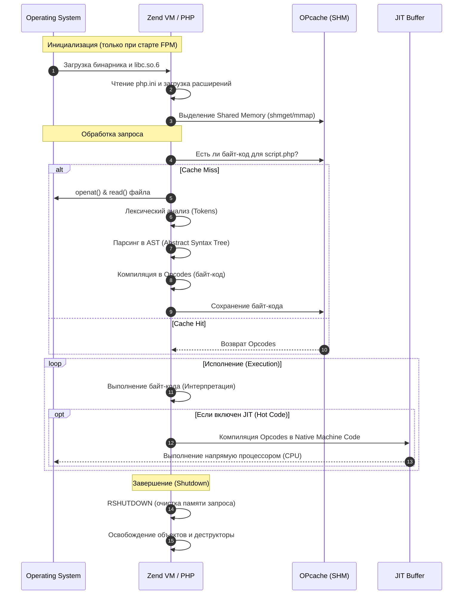

1.  Написать PHP-скрипт и отследить его полный lifecycle:

    -   запустить с `strace -f php script.php`,
    -   понять, какие системные вызовы делает PHP при запуске.

PHP-CGI выполняет шаги 1–5 (запуск среды) (загрузка бинарника, парсинг конфигов, инициализация расширений) на каждый запрос. PHP-FPM делает это один раз при старте master-процесса. Рабочие процессы (workers) уже имеют всё необходимое в памяти и сразу переходят к шагу 6, что ускоряет выполнение в разы.

