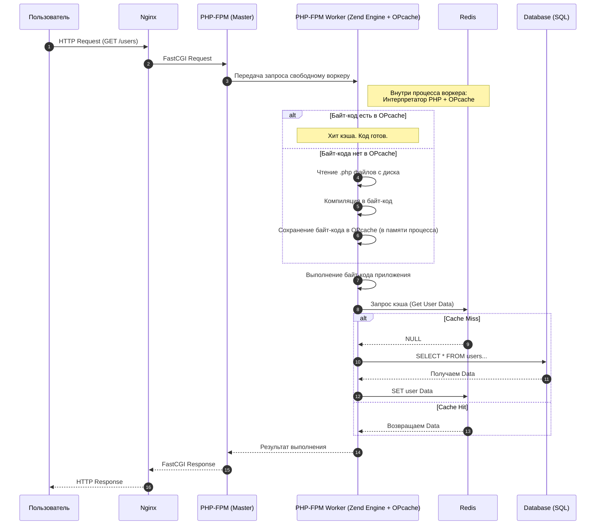

## [На главную](README.md)
# 5. Архитектура PHP-приложения

```mermaid
sequenceDiagram
    autonumber
    participant Client as Пользователь
    participant Nginx
    participant FPMMaster as PHP-FPM (Master)
    participant FPMWorker as PHP-FPM Worker (Zend Engine + OPcache)
    participant Redis as Redis
    participant DB as Database (SQL)

    Client->>Nginx: HTTP Request (GET /users)
    Nginx->>FPMMaster: FastCGI Request
    FPMMaster->>FPMWorker: Передача запроса свободному воркеру

    Note right of FPMWorker: Внутри процесса воркера:<br/>Интерпретатор PHP + OPcache
    alt Байт-код есть в OPcache
        Note over FPMWorker: Хит кэша. Код готов.
    else Байт-кода нет в OPcache
        FPMWorker->>FPMWorker: Чтение .php файлов с диска
        FPMWorker->>FPMWorker: Компиляция в байт-код
        FPMWorker->>FPMWorker: Сохранение байт-кода в OPcache (в памяти процесса)
    end

    FPMWorker->>FPMWorker: Выполнение байт-кода приложения
    FPMWorker->>Redis: Запрос кэша (Get User Data)
    alt Cache Miss
        Redis-->>FPMWorker: NULL
        FPMWorker->>DB: SELECT * FROM users...
        DB-->>FPMWorker: Получаем Data
        FPMWorker->>Redis: SET user Data
    else Cache Hit
        Redis-->>FPMWorker: Возвращаем Data
    end

    FPMWorker-->>FPMMaster: Результат выполнения
    FPMMaster-->>Nginx: FastCGI Response
    Nginx-->>Client: HTTP Response
```