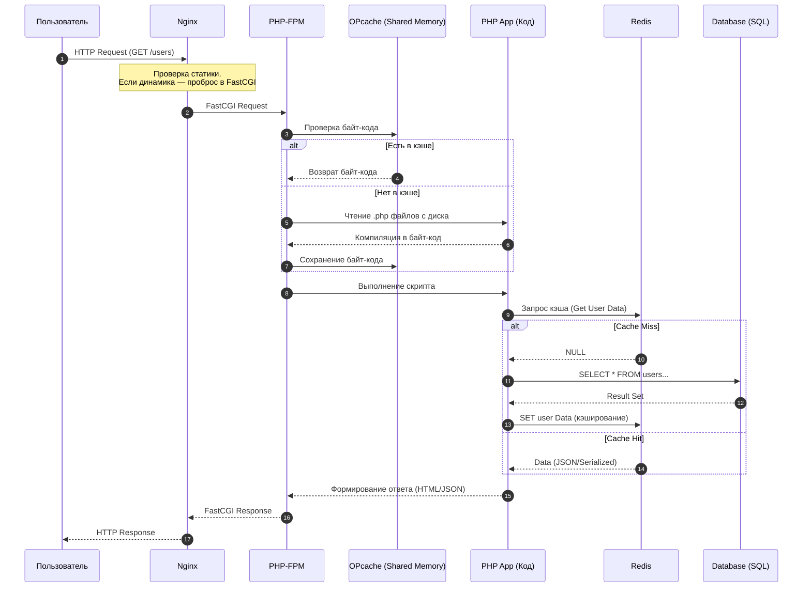

5.  Нарисовать архитектуру PHP-приложения:

    -   показать цепочку: Nginx → PHP-FPM → OPcache → приложение → Redis → DB.
    -   объяснить, где узкие места и как добавить кэш/очередь.

```mermaid
sequenceDiagram
    autonumber
    participant Client as Пользователь
    participant Nginx
    participant FPM as PHP-FPM 
    participant OPC as OPcache (Shared Memory)
    participant App as PHP App (Код)
    participant Redis as Redis 
    participant DB as Database (SQL)

    Client->>Nginx: HTTP Request (GET /users)
    
    Note over Nginx: Проверка статики. <br/>Если динамика — проброс в FastCGI
    
    Nginx->>FPM: FastCGI Request
    
    FPM->>OPC: Проверка байт-кода
    alt Есть в кэше
        OPC-->>FPM: Возврат байт-кода
    else Нет в кэше
        FPM->>App: Чтение .php файлов с диска
        App-->>FPM: Компиляция в байт-код
        FPM->>OPC: Сохранение байт-кода
    end

    FPM->>App: Выполнение скрипта
    
    App->>Redis: Запрос кэша (Get User Data)
    alt Cache Miss
        Redis-->>App: NULL
        App->>DB: SELECT * FROM users...
        DB-->>App: Result Set
        App->>Redis: SET user Data (кэширование)
    else Cache Hit
        Redis-->>App: Data (JSON/Serialized)
    end

    App-->>FPM: Формирование ответа (HTML/JSON)
    FPM-->>Nginx: FastCGI Response
    Nginx-->>Client: HTTP Response
```